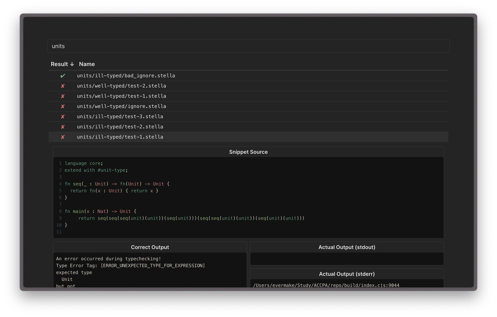

# Stella testing utilities



## About

Scripts for testing Stella implementation for the "Advanced Compilers Construction and Program Analysis" course.

## Usage

To test your implementation you need:

1. **Prepare test files**: (already generated and located at `./tests` directory for you) `.stella` and `.stella.out` files containing output from the correct Stella implementation
2. [**Generate report**: run your implementation across these test files and generate report in `.json` format](#generating-reports)
3. [**Explore report**: see the results](#printing-report)

### Generating report

When you have your typechecker implementation file you can test it across test files and generate the report file.

<details>
<summary>❗️ Make sure your implementation file follows requirements:</summary>

- It is an executable file
  - for interpreted languages like Python or JavaScript you can add shebang in the beginning like `#!/usr/bin/env python` or `#!/usr/bin/env node`
  - or you can just create a Bash script, that will execute your code
- It is granted the execution permission (e.g. `chmod +x path/to/typechecker`)
- It accepts Stella source code in **stdin**
- It prints typechecking results to stdout or stderr
- It exits with zero exit code on success
- It exits with non-zero exit code on error
</details>

Assuming you're at the root of this repository, run the JS script:

```sh
# Using NodeJS
node ./build/test-typechecker.js -t path/to/typechecker -o report.json ./tests

# Using Bun
bun run ./build/test-typechecker.js -t path/to/typechecker -o report.json ./tests
```

### Exploring report

Running script above should produce a `report.json`. To see results, you have two options:

Option 1. Go to [evermake.github.io/stella-testing/](https://evermake.github.io/stella-testing/), upload the generated `report.json` file, explore!

Option 2. Or you can use terminal to print the summary:

```sh
# Using NodeJS
node ./build/print-report.js report.json

# Using Bun
bun run ./build/print-report.js report.json
```
